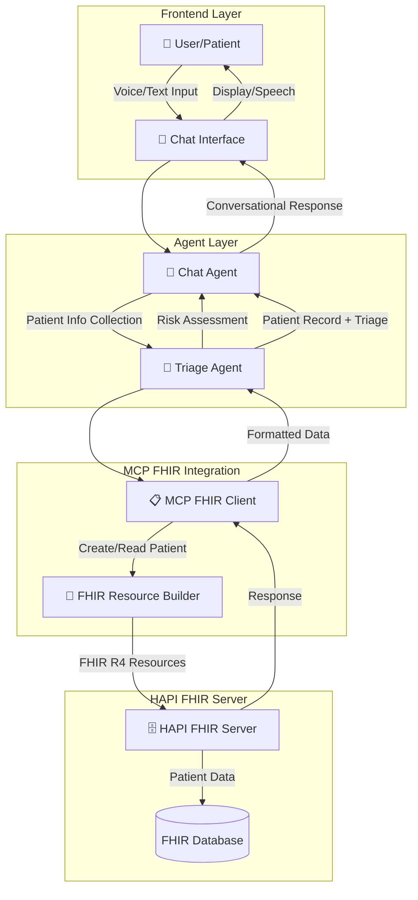

# 🤖 Chatbot-Driven Patient Registration & Triage System - Roadmap

## Architecture Overview



## System Flow Diagram

```
┌─────────────────────────────────────────────────────────────────────┐
│                     CHATBOT PATIENT REGISTRATION FLOW               │
└─────────────────────────────────────────────────────────────────────┘

1. USER INTERACTION
   ┌────────────┐
   │   Patient  │
   │  👤 User   │
   └─────┬──────┘
         │ "I need to register as a new patient"
         ▼
   
2. CHAT AGENT LAYER
   ┌─────────────────────────────────────┐
   │        💬 CHAT AGENT                │
   │  - Natural Language Processing      │
   │  - Context Management               │
   │  - Conversation Flow                │
   └─────────────┬───────────────────────┘
                 │ Collects: Name, DOB, Phone
                 ▼
   
3. INFORMATION GATHERING
   ┌─────────────────────────────────────┐
   │     CONVERSATIONAL DATA FLOW        │
   │                                     │
   │  Bot: "What's your first name?"    │
   │  User: "John"                      │
   │                                     │
   │  Bot: "Last name?"                 │
   │  User: "Doe"                       │
   │                                     │
   │  Bot: "Date of birth?"             │
   │  User: "January 1, 1990"           │
   │                                     │
   │  Bot: "Phone number?"              │
   │  User: "555-555-5555"              │
   │                                     │
   │  Bot: "Any symptoms today?"        │
   │  User: "Fever and headache"        │
   └─────────────┬───────────────────────┘
                 │
                 ▼
   
4. TRIAGE AGENT PROCESSING
   ┌─────────────────────────────────────┐
   │        🏥 TRIAGE AGENT              │
   │  - Symptom Analysis                │
   │  - Risk Assessment                 │
   │  - Priority Assignment             │
   │  - Care Recommendations            │
   └─────────────┬───────────────────────┘
                 │ Priority: HIGH
                 │ Reason: Fever symptoms
                 ▼
   
5. MCP FHIR CLIENT
   ┌─────────────────────────────────────┐
   │      📋 MCP FHIR CLIENT            │
   │  - Resource Construction           │
   │  - Validation                      │
   │  - API Communication               │
   └─────────────┬───────────────────────┘
                 │ POST /Patient
                 ▼
   
6. HAPI FHIR SERVER
   ┌─────────────────────────────────────┐
   │      🗄️ HAPI FHIR SERVER           │
   │  - Patient Resource Storage        │
   │  - ID Generation                   │
   │  - Version Management              │
   └─────────────┬───────────────────────┘
                 │ Patient ID: 12345
                 ▼
   
7. RESPONSE TO USER
   ┌─────────────────────────────────────┐
   │         CONFIRMATION                │
   │  "✅ Registration complete!         │
   │   Patient ID: 12345                │
   │   Triage: HIGH Priority            │
   │   Next: See doctor immediately"    │
   └─────────────────────────────────────┘
```

## Implementation Roadmap

### Phase 1: Foundation (Weeks 1-2)
```
┌─────────────────────────────────────────┐
│  1.1 Setup Base Infrastructure          │
├─────────────────────────────────────────┤
│  • Deploy current HAPI FHIR app        │
│  • Setup chat interface (Web/Telegram) │
│  • Basic conversation flow             │
└─────────────────────────────────────────┘
```

### Phase 2: Chat Agent Development (Weeks 3-4)
```
┌─────────────────────────────────────────┐
│  2.1 Conversational AI Integration      │
├─────────────────────────────────────────┤
│  • LLM integration (GPT/Claude)        │
│  • Intent recognition                  │
│  • Entity extraction                   │
│  • Multi-turn conversation management  │
└─────────────────────────────────────────┘

┌─────────────────────────────────────────┐
│  2.2 Data Collection Flows              │
├─────────────────────────────────────────┤
│  • Patient demographics flow           │
│  • Contact information flow            │
│  • Medical history flow                │
│  • Symptom collection flow             │
└─────────────────────────────────────────┘
```

### Phase 3: Triage Agent Integration (Weeks 5-6)
```
┌─────────────────────────────────────────┐
│  3.1 Triage Logic Implementation        │
├─────────────────────────────────────────┤
│  • Symptom severity scoring            │
│  • Risk assessment algorithms          │
│  • Priority queue management           │
│  • Care pathway recommendations        │
└─────────────────────────────────────────┘

┌─────────────────────────────────────────┐
│  3.2 Clinical Decision Support          │
├─────────────────────────────────────────┤
│  • Rule-based triage protocols        │
│  • Emergency detection                 │
│  • Referral suggestions                │
└─────────────────────────────────────────┘
```

### Phase 4: MCP FHIR Integration (Weeks 7-8)
```
┌─────────────────────────────────────────┐
│  4.1 FHIR Resource Management          │
├─────────────────────────────────────────┤
│  • Patient resource builder            │
│  • Encounter resource creation         │
│  • Observation resource for symptoms   │
│  • Condition resource for diagnoses    │
└─────────────────────────────────────────┘

┌─────────────────────────────────────────┐
│  4.2 HAPI Server Communication         │
├─────────────────────────────────────────┤
│  • Create patient endpoint             │
│  • Search patient endpoint             │
│  • Update patient endpoint             │
│  • Batch operations                    │
└─────────────────────────────────────────┘
```

## Technical Architecture

### 1. Chat Agent Components
```javascript
// Chat Agent Structure
{
  "chatAgent": {
    "nlp": {
      "provider": "OpenAI/Claude",
      "model": "gpt-4/claude-3",
      "functions": [
        "extractPatientInfo",
        "validateData",
        "generateResponse"
      ]
    },
    "conversation": {
      "state": "collecting_demographics",
      "context": {},
      "history": []
    },
    "flows": {
      "registration": ["name", "dob", "phone", "email"],
      "triage": ["symptoms", "duration", "severity", "medications"]
    }
  }
}
```

### 2. Triage Agent Components
```javascript
// Triage Agent Structure
{
  "triageAgent": {
    "assessment": {
      "symptoms": [],
      "vitalSigns": {},
      "riskFactors": []
    },
    "scoring": {
      "algorithm": "ESI_Triage_Scale",
      "levels": {
        "1": "Resuscitation",
        "2": "Emergent",
        "3": "Urgent",
        "4": "Less Urgent",
        "5": "Non-Urgent"
      }
    },
    "recommendations": {
      "immediate": "Emergency Room",
      "urgent": "Same Day Appointment",
      "routine": "Schedule Appointment"
    }
  }
}
```

### 3. MCP FHIR Client Components
```javascript
// MCP FHIR Client Structure
{
  "mcpFhirClient": {
    "resources": {
      "patient": {
        "create": "POST /Patient",
        "read": "GET /Patient/{id}",
        "search": "GET /Patient?name={name}"
      },
      "encounter": {
        "create": "POST /Encounter",
        "addTriage": "POST /Encounter/{id}/_triage"
      }
    },
    "validation": {
      "schema": "FHIR R4",
      "required": ["resourceType", "name", "birthDate"]
    }
  }
}
```

## Data Flow Example

### User Conversation
```
User: "I need to see a doctor"

ChatBot: "I'll help you register. What's your first name?"
User: "John"

ChatBot: "Thank you, John. What's your last name?"
User: "Smith"

ChatBot: "Date of birth?"
User: "May 15, 1985"

ChatBot: "Phone number?"
User: "555-555-5555"

ChatBot: "What symptoms are you experiencing?"
User: "Severe chest pain for 2 hours"

[TRIAGE AGENT TRIGGERED]
Priority: EMERGENCY (Level 1)

ChatBot: "⚠️ Based on your symptoms, you need immediate medical attention. 
         I've registered you with ID: 12345
         Please go to the Emergency Room immediately or call 911."
```

### Backend Processing
```javascript
// 1. Chat Agent collects data
const patientData = {
  firstName: "John",
  lastName: "Smith",
  birthDate: "1985-05-15",
  phone: "555-555-5555",
  symptoms: "Severe chest pain"
};

// 2. Triage Agent assessment
const triageResult = {
  level: 1,
  priority: "EMERGENCY",
  recommendation: "Immediate ER",
  reason: "Chest pain - possible cardiac event"
};

// 3. MCP FHIR Client creates resources
const fhirPatient = {
  resourceType: "Patient",
  name: [{
    given: ["John"],
    family: "Smith"
  }],
  birthDate: "1985-05-15",
  telecom: [{
    system: "phone",
    value: "555-555-5555"
  }],
  extension: [{
    url: "http://example.org/fhir/triage",
    valueCodeableConcept: {
      coding: [{
        system: "http://example.org/triage-level",
        code: "1",
        display: "Emergency"
      }]
    }
  }]
};

// 4. Send to HAPI FHIR Server
POST https://hapi.fhir.org/baseR4/Patient
Response: { id: "12345", resourceType: "Patient" }
```

## Technology Stack

### Frontend
- **Chat Interface**: React/Vue.js Web Component
- **Voice Input**: Web Speech API
- **Mobile**: React Native / Flutter

### Backend
- **Chat Agent**: 
  - Node.js/Python
  - LangChain/OpenAI SDK
  - WebSocket for real-time

- **Triage Agent**:
  - Clinical decision rules engine
  - ML models for symptom analysis
  - Priority queue system

- **MCP FHIR Client**:
  - FHIR.js library
  - REST API client
  - Resource validators

### Infrastructure
- **Deployment**: Railway/Docker
- **Database**: PostgreSQL for session data
- **Cache**: Redis for conversation state
- **Queue**: RabbitMQ for async processing

## Security & Compliance

```
┌─────────────────────────────────────────┐
│         SECURITY LAYERS                 │
├─────────────────────────────────────────┤
│  • End-to-end encryption (TLS 1.3)     │
│  • HIPAA compliance for PHI            │
│  • OAuth 2.0 for API authentication    │
│  • Audit logging for all transactions  │
│  • Data retention policies             │
│  • Consent management                  │
└─────────────────────────────────────────┘
```

## Monitoring & Analytics

```
┌─────────────────────────────────────────┐
│       METRICS & MONITORING              │
├─────────────────────────────────────────┤
│  • Registration completion rate        │
│  • Average conversation duration       │
│  • Triage accuracy metrics             │
│  • API response times                  │
│  • Error rates and recovery            │
│  • User satisfaction scores            │
└─────────────────────────────────────────┘
```

## Future Enhancements

### Phase 5: Advanced Features
- **Multi-language support**
- **Integration with EHR systems**
- **Appointment scheduling**
- **Prescription management**
- **Insurance verification**
- **Telemedicine integration**

### Phase 6: AI Enhancements
- **Predictive triage models**
- **Natural language understanding improvements**
- **Voice biometrics for authentication**
- **Sentiment analysis for patient experience**

---

## Quick Start Implementation

```bash
# 1. Clone and setup base
git clone https://github.com/karthi1975/mcpfhir.git
cd mcpfhir
npm install

# 2. Add chat dependencies
npm install openai langchain socket.io

# 3. Create agent structure
mkdir -p agents/{chat,triage,fhir}

# 4. Implement chat endpoint
# server.js additions needed

# 5. Deploy
railway up
```

---

*This roadmap provides a comprehensive architecture for implementing a chatbot-driven patient registration system with triage capabilities, fully integrated with FHIR standards.*