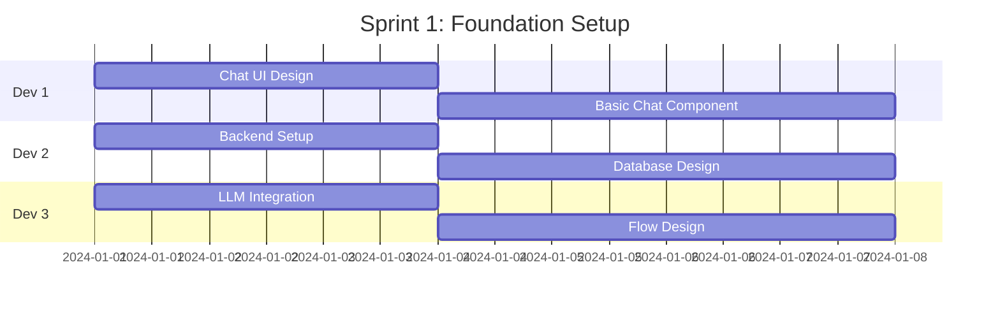
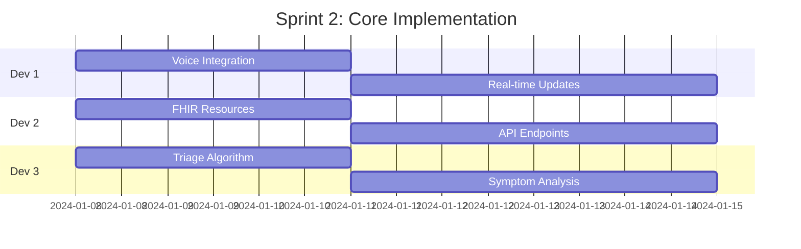
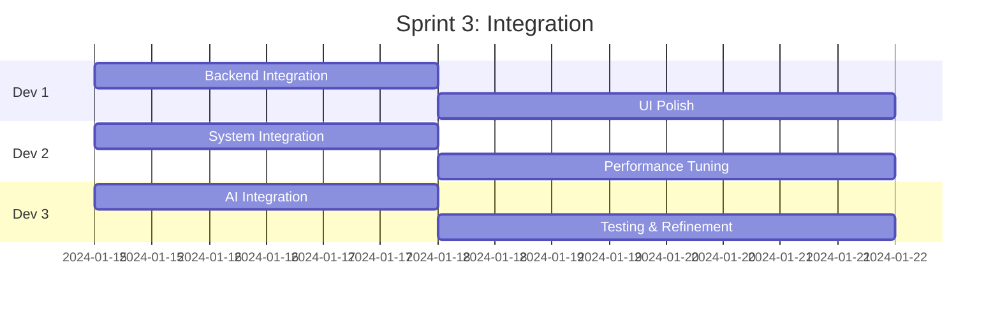

# 👥 Team Development Plan - 3 Person Team

## Team Structure & Roles

```
┌─────────────────────────────────────────────────────────────────┐
│                    TEAM ORGANIZATION                             │
├─────────────────────────────────────────────────────────────────┤
│                                                                  │
│  👨‍💻 Developer 1          👩‍💻 Developer 2         👨‍💻 Developer 3   │
│  FRONTEND/CHAT          BACKEND/FHIR         AI/TRIAGE         │
│  Lead                   Lead                 Lead              │
│                                                                  │
└─────────────────────────────────────────────────────────────────┘
```

---

## 👨‍💻 **Developer 1: Frontend & Chat Interface Lead**

### Primary Responsibilities
```yaml
Role: Frontend Developer & UX Specialist
Focus: User Interface, Chat Experience, Voice Integration
Technologies: React/Vue, WebSocket, Web Speech API
```

### Core Tasks

#### Week 1-2: Foundation
- [ ] Design chat interface mockups
- [ ] Implement responsive chat UI component
- [ ] Setup WebSocket connection for real-time messaging
- [ ] Create typing indicators and message bubbles

#### Week 3-4: Chat Features
- [ ] Implement conversation flow UI
- [ ] Add voice input/output capabilities
- [ ] Create progress indicators for registration steps
- [ ] Build patient dashboard view

#### Week 5-6: Integration
- [ ] Connect with backend WebSocket server
- [ ] Implement error handling and retry logic
- [ ] Add offline message queuing
- [ ] Create admin dashboard for conversation monitoring

### Technical Ownership
```javascript
// Components to Build
frontend/
├── components/
│   ├── ChatInterface.jsx       // Main chat component
│   ├── MessageBubble.jsx       // Individual messages
│   ├── VoiceInput.jsx          // Voice recognition
│   ├── QuickReplies.jsx        // Suggested responses
│   ├── ProgressTracker.jsx     // Registration progress
│   └── PatientCard.jsx         // Patient display
├── services/
│   ├── websocket.js            // WebSocket client
│   ├── speechRecognition.js    // Voice processing
│   └── apiClient.js            // REST API calls
└── styles/
    ├── chat.css                // Chat-specific styles
    └── animations.css          // Transitions/animations
```

### Deliverables Checklist
- [ ] Responsive chat interface (mobile-first)
- [ ] Voice input/output functionality
- [ ] Real-time message updates
- [ ] Typing indicators
- [ ] Message history display
- [ ] Quick reply buttons
- [ ] File upload capability (for documents)
- [ ] Multi-language UI support

---

## 👩‍💻 **Developer 2: Backend & FHIR Integration Lead**

### Primary Responsibilities
```yaml
Role: Backend Developer & FHIR Specialist
Focus: Server Architecture, FHIR Resources, API Development
Technologies: Node.js, Express, FHIR.js, PostgreSQL
```

### Core Tasks

#### Week 1-2: Backend Setup
- [ ] Setup Express server with WebSocket support
- [ ] Design database schema for conversations
- [ ] Implement session management
- [ ] Create REST API endpoints

#### Week 3-4: FHIR Integration
- [ ] Build FHIR resource builders (Patient, Encounter, Observation)
- [ ] Implement HAPI FHIR server communication
- [ ] Create data validation middleware
- [ ] Setup error handling and logging

#### Week 5-6: Advanced Features
- [ ] Implement batch FHIR operations
- [ ] Add search and filter capabilities
- [ ] Create audit logging system
- [ ] Build analytics endpoints

### Technical Ownership
```javascript
// Backend Structure
backend/
├── routes/
│   ├── chat.js                 // Chat endpoints
│   ├── patients.js             // Patient CRUD
│   ├── triage.js               // Triage endpoints
│   └── analytics.js           // Metrics/reporting
├── services/
│   ├── fhirClient.js          // FHIR server communication
│   ├── resourceBuilder.js     // FHIR resource creation
│   ├── validator.js           // Data validation
│   └── sessionManager.js      // Conversation sessions
├── models/
│   ├── conversation.js        // Chat history model
│   ├── patient.js             // Patient cache model
│   └── triageResult.js        // Triage outcomes
└── middleware/
    ├── authentication.js       // Auth middleware
    ├── errorHandler.js        // Error handling
    └── logger.js              // Request logging
```

### Deliverables Checklist
- [ ] WebSocket server for real-time chat
- [ ] RESTful API for patient operations
- [ ] FHIR resource builders and validators
- [ ] Database integration (PostgreSQL)
- [ ] Session management system
- [ ] Audit logging implementation
- [ ] API documentation (Swagger/OpenAPI)
- [ ] Performance monitoring endpoints

---

## 👨‍💻 **Developer 3: AI & Triage System Lead**

### Primary Responsibilities
```yaml
Role: AI/ML Developer & Clinical Logic Specialist
Focus: NLP, Triage Algorithms, LLM Integration
Technologies: Python/Node.js, OpenAI/Claude API, TensorFlow
```

### Core Tasks

#### Week 1-2: AI Foundation
- [ ] Setup LLM integration (OpenAI/Claude)
- [ ] Design conversation flow logic
- [ ] Implement intent recognition
- [ ] Create entity extraction system

#### Week 3-4: Triage System
- [ ] Implement ESI triage algorithm
- [ ] Build symptom analysis engine
- [ ] Create risk assessment scoring
- [ ] Develop care pathway recommendations

#### Week 5-6: Intelligence Layer
- [ ] Train custom NLP models for medical terms
- [ ] Implement conversation context management
- [ ] Add sentiment analysis
- [ ] Build predictive triage models

### Technical Ownership
```javascript
// AI/Triage Structure
ai-services/
├── agents/
│   ├── chatAgent.js           // Conversation management
│   ├── triageAgent.js         // Medical triage logic
│   └── dataExtractor.js       // Entity extraction
├── nlp/
│   ├── intentClassifier.js    // Intent recognition
│   ├── entityExtractor.js     // Extract patient data
│   ├── sentimentAnalyzer.js   // Patient mood analysis
│   └── medicalNER.js          // Medical entity recognition
├── triage/
│   ├── esiAlgorithm.js        // ESI triage scale
│   ├── symptomScorer.js       // Symptom severity scoring
│   ├── riskAssessment.js      // Risk calculation
│   └── recommendations.js     // Care pathway logic
└── models/
    ├── conversation.json       // Conversation flows
    ├── symptoms.json          // Symptom database
    └── protocols.json         // Triage protocols
```

### Deliverables Checklist
- [ ] LLM integration layer
- [ ] Intent classification system
- [ ] Entity extraction for patient data
- [ ] ESI triage algorithm implementation
- [ ] Symptom severity scoring
- [ ] Risk assessment engine
- [ ] Care recommendation system
- [ ] Conversation flow manager
- [ ] Medical knowledge base

---

## 📅 **Sprint Planning & Collaboration**

### Sprint 1 (Weeks 1-2): Foundation


### Sprint 2 (Weeks 3-4): Core Features


### Sprint 3 (Weeks 5-6): Integration & Polish


---

## 🔄 **Collaboration Points**

### Daily Sync Points
```yaml
Integration Points:
  Dev1 ↔ Dev2:
    - WebSocket protocol definition
    - API contract for frontend
    - Session management strategy
    
  Dev2 ↔ Dev3:
    - Data format for AI processing
    - FHIR resource mapping
    - Triage result structure
    
  Dev1 ↔ Dev3:
    - Conversation UI requirements
    - Response format for display
    - Error message handling
```

### Shared Responsibilities

#### All Team Members
- [ ] Code reviews for each other's PRs
- [ ] Documentation updates
- [ ] Integration testing
- [ ] Security review
- [ ] Performance testing

#### Pair Programming Sessions
- **Week 2**: Dev1 + Dev2 - WebSocket implementation
- **Week 3**: Dev2 + Dev3 - FHIR resource mapping
- **Week 4**: Dev1 + Dev3 - Conversation flow integration
- **Week 5**: All - System integration
- **Week 6**: All - End-to-end testing

---

## 📊 **Success Metrics**

### Developer 1 KPIs
- Chat interface loads < 2 seconds
- Voice recognition accuracy > 95%
- Mobile responsive score > 98
- User satisfaction score > 4.5/5

### Developer 2 KPIs
- API response time < 200ms
- FHIR validation success rate > 99%
- System uptime > 99.9%
- Zero data loss incidents

### Developer 3 KPIs
- Intent recognition accuracy > 90%
- Triage accuracy > 95%
- Average conversation completion < 5 minutes
- False positive rate < 5%

---

## 🛠️ **Development Tools & Environment**

### Shared Tools
```yaml
Version Control: Git/GitHub
Project Management: Jira/Linear
Communication: Slack/Discord
Documentation: Confluence/Notion
CI/CD: GitHub Actions
Deployment: Railway/Docker
```

### Development Setup
```bash
# Repository structure
chatbot-fhir-system/
├── frontend/          # Dev 1 ownership
├── backend/           # Dev 2 ownership
├── ai-services/       # Dev 3 ownership
├── shared/            # Shared utilities
├── docs/              # Documentation
└── tests/             # Test suites
```

---

## 📝 **Communication Protocol**

### Code Review Process
1. Create feature branch: `feature/dev1-chat-interface`
2. Submit PR with description
3. Tag relevant team member for review
4. Address feedback within 24 hours
5. Merge after approval from 1 reviewer

### Documentation Requirements
- Each developer maintains their module README
- API changes require documentation update
- Weekly progress reports in shared doc
- Architecture decisions recorded in ADRs

### Meeting Schedule
- **Daily Standup**: 9:00 AM (15 min)
- **Weekly Planning**: Monday 10:00 AM (1 hour)
- **Sprint Review**: Every 2 weeks Friday 2:00 PM
- **Technical Deep Dive**: Wednesday 3:00 PM (optional)

---

## 🚀 **Deployment Responsibilities**

### Dev 1: Frontend Deployment
- Build and optimize frontend assets
- Configure CDN for static files
- Setup monitoring for UI performance

### Dev 2: Backend Deployment
- Database migrations
- Server deployment and scaling
- API monitoring and logging

### Dev 3: AI Services Deployment
- Model deployment and versioning
- API key management
- Performance monitoring for AI services

---

## 📈 **Career Growth Paths**

### Developer 1 Growth
- Learn healthcare UX best practices
- Explore accessibility standards (WCAG)
- Master real-time communication protocols

### Developer 2 Growth
- Become FHIR certified
- Learn healthcare interoperability standards
- Master microservices architecture

### Developer 3 Growth
- Specialize in medical NLP
- Learn clinical decision support systems
- Explore healthcare AI regulations

---

*This plan ensures each team member has clear ownership while maintaining collaborative integration points for successful project delivery.*